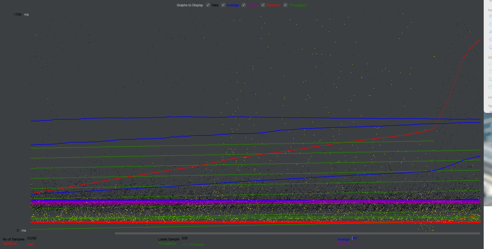

# JMeter Performance Test - Flight Booking Website

## Test Overview
This repository contains JMeter performance test scripts for a flight booking website (BlazeDemo). The tests simulate users searching for flights, selecting specific flights, and completing the purchase process.

## Test Configuration
Initial test:
- 5 threads (users)
- 5 second ramp-up period
- 1 loop

Final stress test:
- 2000 threads (users)
- 2 second ramp-up period
- 5 loops (10,000 total executions)

## Test Results Summary
Initial testing with 5 users showed the system performing well, but when scaled to 2000 concurrent users, significant performance degradation was observed:

- Average response time: 3779ms (>3.7 seconds)
- Error rate: 6.76% overall
- Max response time: 52091ms (>52 seconds!)
- Homepage error rate: 6.24%
- Purchase Flight error rate: 7.41%

## Conclusion
The test revealed that the system cannot handle 2000 concurrent users effectively. The high error rates (>6%) and extremely long maximum response times (>52 seconds) indicate severe performance issues under heavy load.

The system began showing signs of degradation with moderate user loads and completely deteriorated under the stress test configuration.
